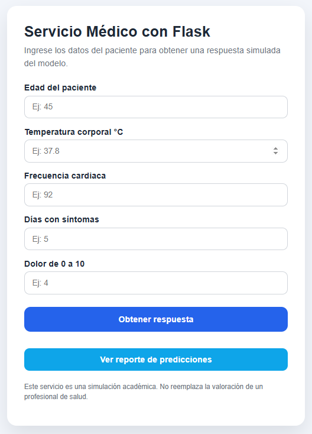
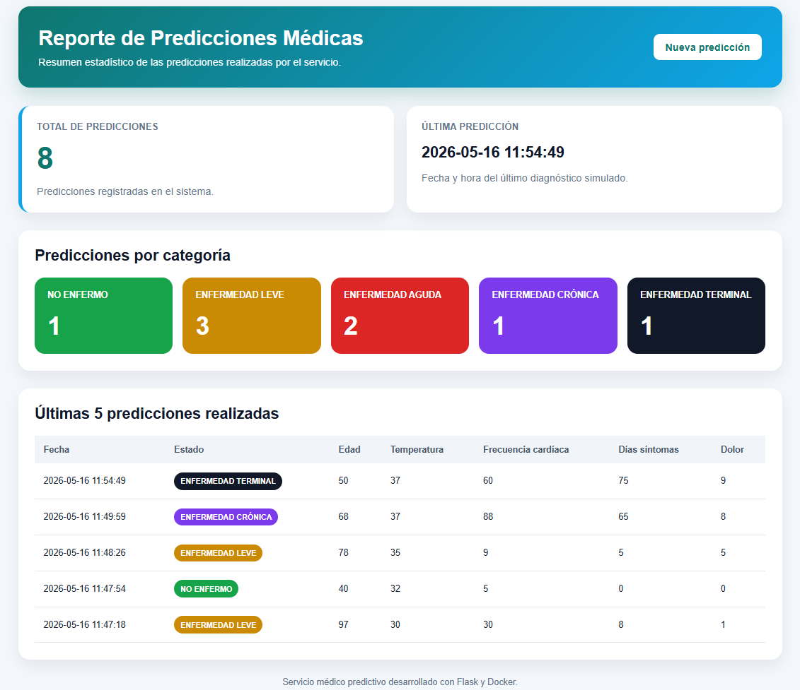

# Servicio Médico con Flask y Docker

**Equipo**:
|Nombres |
|---------|
|Anderson Daniel Pipicano Ruiz|
|Fredy Yamid Alvarez Palechor |

## 1. Problema

Actualmente, el sector salud genera grandes volúmenes de información provenientes de historias
clínicas, registros hospitalarios, laboratorios y plataformas epidemiológicas, creando la posibilidad de
implementar soluciones inteligentes que apoyen el diagnóstico médico y mejoren la toma de
decisiones clínicas. En este contexto, se propone desarrollar una solución basada en Machine Learning
y MLOps capaz de predecir la posible presencia de enfermedades comunes y huérfanas a partir de
síntomas, antecedentes y datos clínicos de los pacientes, integrando información proveniente de
múltiples fuentes médicas. La solución busca reducir diagnósticos tardíos o incorrectos, optimizar la
priorización de pacientes y mejorar la asignación de recursos médicos mediante modelos predictivos
confiables, monitoreados y capaces de adaptarse continuamente a nuevos datos y cambios
epidemiológicos.

El pipeline integra procesos de adquisición de datos, aseguramiento de calidad, ingeniería de
características, entrenamiento de modelos, despliegue de servicios inteligentes y monitoreo continuo,
permitiendo construir una solución escalable, reproducible y adaptable a nuevos datos clínicos.

## 2. Proposito

El objetivo es construir un sistema de Machine Learning capaz de predecir, a partir de síntomas y datos clínicos de un paciente, la posible presencia de enfermedades tanto comunes (muchos datos disponibles) como huérfanas (muy pocos datos disponibles).

Debido a la naturaleza médica del problema, el pipeline debe considerar aspectos de calidad de datos, interpretabilidad, privacidad, actualización continua y monitoreo clínico.

Reducir el riesgo clínico y mejorar la toma de decisiones médicas mediante la detección temprana y automatizada de posibles enfermedades (comunes y huérfanas) a partir de datos de síntomas y registros clínicos, optimizando recursos del sistema de salud y mejorando la precisión diagnóstica.

## 3. Finalidad de la solución

Este proyecto implementa una solución mediante un servicio web que simula el uso de un modelo clínico.

El objetivo es que un médico pueda ingresar datos básicos de un paciente y recibir uno de los siguientes estados:

- `NO ENFERMO`
- `ENFERMEDAD LEVE`
- `ENFERMEDAD AGUDA`
- `ENFERMEDAD CRÓNICA`
- `ENFERMEDAD TERMINAL`

En el desarrollo del modelo de machine learning se realizó una simulación del comportamiento del modelo se simula mediante una función llamada `predecir_estado`, ubicada en el archivo `model/model.py`.

> Importante: esta solución es académica, demostrativa y como se puede implementar una solución a futuro para dicha problemática, esto no debería reemplazar el criterio médico ni debe usarse para diagnóstico real.

---

## 4. Estructura del proyecto

```text
servicio_medico_flask/
│
├── app.py                            # Aplicación Flask y función simulada del modelo
├── requirements.txt                  # Dependencias del proyecto
├── Dockerfile                        # Archivo para construir la imagen Docker
├── README.md                         # Instrucciones de uso
├── .dockerignore                     # Archivos ignorados por Docker
│
├── data/
│   └── historial_predicciones.json   # Json de predicciones almacenadas
│
├── img/
│   └── image-1.png                   # Formulario medico para realizar predicción
│   └── image.png                     # Reporte de predicciones
│
├── model/
│   └── model.py                      # Módulo de predicción clínica simulada
│
├── static/
│   └── style.css                     # Estilos de la página web
│
├── templates/
│   └── index.html                    # Página web sencilla para ingresar datos
│
├── tests/
│   └── test_predict.py               # Pruebas básicas de la función de predicción
│
└── utils/
    └── convertir_valores.py          # Módulo de conversión de valores para validación y normalización de datos│
```

---

## 5. Variables de entrada

La función recibe 5 variables para hacer la simulación más real referente al diagnóstico:

| Variable              | Descripción                             | Ejemplo |
| --------------------- | --------------------------------------- | ------- |
| `edad`                | Edad del paciente en años               | `45`    |
| `temperatura`         | Temperatura corporal en grados Celsius  | `38.2`  |
| `frecuencia_cardiaca` | Latidos por minuto                      | `105`   |
| `dias_sintomas`       | Días que lleva el paciente con síntomas | `3`     |
| `dolor`               | Nivel de dolor de 0 a 10                | `4`     |

---

## 6. Lógica simulada del modelo

La función `predecir_estado` retorna un estado según reglas sencillas:

- Retorna `ENFERMEDAD TERMINAL` si los síntomas llevan mucho tiempo o no existe persistencia clínica.
- Retorna `ENFERMEDAD CRÓNICA` si los síntomas llevan mucho tiempo o existe persistencia clínica.
- Retorna `ENFERMEDAD AGUDA` si hay fiebre alta, frecuencia cardiaca muy elevada o dolor intenso reciente.
- Retorna `ENFERMEDAD LEVE` si hay síntomas moderados sin señales de severidad alta.
- Retorna `NO ENFERMO` si no hay señales relevantes en los valores ingresados.

Ejemplos que permiten obtener cada estado:

| Estado esperado       | Edad | Temperatura | Frecuencia cardiaca | Días síntomas | Dolor |
| --------------------- | ---: | ----------: | ------------------: | ------------: | ----: |
| `NO ENFERMO`          |   25 |        36.5 |                  75 |             0 |     0 |
| `ENFERMEDAD LEVE`     |   30 |        37.8 |                  90 |             2 |     3 |
| `ENFERMEDAD AGUDA`    |   40 |        39.4 |                 125 |             4 |     8 |
| `ENFERMEDAD CRÓNICA`  |   68 |        37.0 |                  88 |            65 |     5 |
| `ENFERMEDAD TERMINAL` |   50 |        37.0 |                  60 |            75 |     9 |

---

## 7. Ejecutar sin Docker

### 7.1. Crear entorno virtual

En Windows PowerShell:

```bash
python -m venv venv
```

```bash
.\venv\Scripts\activate
```

En Linux/Mac:

```bash
python3 -m venv venv
```

```bash
source venv/bin/activate
```

### 7.2. Instalar dependencias

```bash
pip install -r requirements.txt
```

### 7.3. Ejecutar la aplicación

```bash
python app.py
```

Luego abrir en el navegador:

```text
http://localhost:5000
```

---

## 8. Construir y ejecutar con Docker

### 8.1. Construir la imagen

Desde la carpeta del proyecto:

```bash
docker build -t servicio-medico-mlops-u2 .
```

### 8.2. Ejecutar el contenedor

```bash
docker run -p 5000:5000 servicio-medico-mlops-u2
```

### 8.3. Construir la imagen y ejecutar el contenedor

```bash
docker build -t servicio-medico-mlops-u2 . && docker run -p 5000:5000 servicio-medico-mlops-u2
```

```bash
docker build -t servicio-medico-mlops-u2 . ; docker run -p 5000:5000 servicio-medico-mlops-u2
```

Luego abrir en el navegador:

```text
http://localhost:5000
```

---

## 9. Usar el servicio desde la página web

1. Abra `http://localhost:5000`.
2. Ingrese los datos del paciente.
3. Presione el botón **Obtener respuesta**.
4. El sistema mostrará uno de los estados definidos.

---

## 10. Usar el servicio desde API

El servicio también expone un endpoint tipo API:

```text
POST http://localhost:5000/predecir
```

### Ejemplo con curl

```bash
curl -X POST http://localhost:5000/predecir \
  -H "Content-Type: application/json" \
  -d '{
    "edad": 40,
    "temperatura": 39.4,
    "frecuencia_cardiaca": 125,
    "dias_sintomas": 4,
    "dolor": 8
  }'
```

### Ejemplo con curl en consola

```bash
curl -X POST http://localhost:5000/predecir -H "Content-Type: application/json" -d "{\"edad\":40,\"temperatura\":39.4,\"frecuencia_cardiaca\":125,\"dias_sintomas\":4,\"dolor\":8}"
```

### Respuesta esperada

```json
{
  "estado": "ENFERMEDAD AGUDA",
  "estados_posibles": [
    "NO ENFERMO",
    "ENFERMEDAD LEVE",
    "ENFERMEDAD AGUDA",
    "ENFERMEDAD CRÓNICA"
  ],
  "entrada": {
    "edad": 40,
    "temperatura": 39.4,
    "frecuencia_cardiaca": 125,
    "dias_sintomas": 4,
    "dolor": 8
  },
  "advertencia": "Resultado simulado. No reemplaza valoración médica profesional."
}
```

---

## 11. Probar que la función retorna todos los estados

Se incluyen pruebas unitarias en la carpeta `tests`.

Para ejecutarlas:

```bash
pytest
```

```bash
python -m pytest
```

Estas pruebas validan que la función puede retornar los cuatro estados requeridos.

---

## 12. Endpoints disponibles

| Endpoint    | Método | Descripción                                       |
| ----------- | ------ | ------------------------------------------------- |
| `/`         | GET    | Muestra formulario web                            |
| `/`         | POST   | Recibe datos desde formulario y muestra resultado |
| `/predecir` | POST   | Recibe JSON y retorna predicción en formato JSON  |
| `/salud`    | GET    | Verifica que el servicio esté activo              |

---

## 13. Reporte



